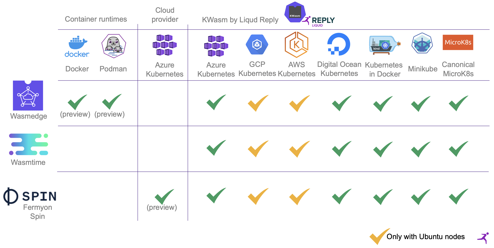

## Supported Kubernetes Distributuions 

## KWasm Operator Quickstart
<ul class="tab" data-tab="1e081df9-bdc6-4e81-8552-aa0a915568e9" data-name="install">
  
      <li class="active">
          <a href="#">kind </a>
      </li>
  
      <li>
          <a href="#">MiniKube </a>
      </li>
  
      <li>
          <a href="#">MicroK8s </a>
      </li>
  
      <li>
          <a href="#">Azure AKS </a>
      </li>
  
      <li>
          <a href="#">DO Kubernetes </a>
      </li>
  
      <li>
          <a href="#">GCP GKE </a>
      </li>
  
      <li>
          <a href="#">AWS EKS </a>
      </li>
  
</ul>
<ul class="tab-content" id="1e081df9-bdc6-4e81-8552-aa0a915568e9" data-name="install">
  
      <li class="active">

<pre class="highlight"><code>kind create cluster
</code></pre>

</li>
  
      <li>

<pre class="highlight"><code>minikube start --container-runtime='containerd'
</code></pre>

</li>
  
      <li>

<pre class="highlight"><code>microk8s install
microk8s status --wait-ready
</code></pre>

</li>
  
      <li>

<pre class="highlight"><code>az group create --name kwasm --location eastus
az aks create \
    --resource-group kwasm \
    --name kwasm \
    --node-count 2 \
    --generate-ssh-keys
</code></pre>

Or follow the official tutorial: <a href="https://learn.microsoft.com/en-us/azure/aks/tutorial-kubernetes-deploy-cluster">tutorial-kubernetes-deploy-cluster</a>

</li>
  
      <li>

<pre class="highlight"><code>doctl kubernetes cluster create kwasm
</code></pre>

</li>
  
      <li>

<pre class="highlight"><code></code></pre>

</li>
  
      <li>

<pre class="highlight"><code>eksctl create cluster --name wasm-eks --node-type=t3.medium --without-nodegroup --version=1.23

# ATENTION, you need to choose the right region and ami
# Look up the appropriate ami for your region: https://cloud-images.ubuntu.com/locator/ec2/
echo 'apiVersion: eksctl.io/v1alpha5
kind: ClusterConfig
metadata:
  name: wasm-eks
  region: us-west-2
managedNodeGroups:
  - name: ng-wasm-eks
    ami: ami-0809c110f957a5eb8
    instanceType: t3.medium
    minSize: 1
    maxSize: 2
    overrideBootstrapCommand: |
      #!/bin/bash
      /etc/eks/bootstrap.sh wasm-eks --container-runtime containerd' | eksctl create nodegroup -f -
</code></pre>

</li>
  
</ul>

<pre class="highlight"><code># Add HELM repository if not already done
helm repo add kwasm http://kwasm.sh/kwasm-operator/
# Install KWasm operator
helm install -n kwasm --create-namespace kwasm-operator kwasm/kwasm-operator
# Provision Nodes
kubectl annotate node --all kwasm.sh/kwasm-node=true
</code></pre>

<ul class="tab" data-tab="38645aeb-b32f-40e5-8b40-5e8065458632" data-name="run">
  
      <li class="active">
          <a href="#">WasmEdge </a>
      </li>
  
      <li>
          <a href="#">Spin </a>
      </li>
  
</ul>
<ul class="tab-content" id="38645aeb-b32f-40e5-8b40-5e8065458632" data-name="run">
  
      <li class="active">

<pre class="highlight"><code>kubectl apply -f https://raw.githubusercontent.com/KWasm/kwasm-node-installer/main/example/test-job.yaml
kubectl logs job/wasm-test
</code></pre>

</li>
  
      <li>

After installing KWasm, start with step 3 of containerd-wasm-shims <a href="https://github.com/deislabs/containerd-wasm-shims#using-a-shim-in-kubernetes">using-a-shim-in-kubernetes</a>

<pre class="highlight"><code>echo '  apiVersion: node.k8s.io/v1                                           
  kind: RuntimeClass
  metadata:
    name: wasmtime-spin
  handler: spin' | kubectl apply -f -

echo '  apiVersion: apps/v1                                                  
  kind: Deployment
  metadata:
    name: wasm-spin
  spec:
    replicas: 1
    selector:
      matchLabels:
        app: wasm-spin
    template:
      metadata:
        labels:
          app: wasm-spin
      spec:
        runtimeClassName: wasmtime-spin
        containers:
        - name: spin-hello
          image: ghcr.io/deislabs/containerd-wasm-shims/examples/spin-rust-hello:latest
          command: ["/"]
' | kubectl apply -f -

# Finally test the hello spin app 🥳
kubectl port-forward deployment/wasm-spin 8000:80&amp;
curl localhost:8000/hello
</code></pre>

</li>
  
</ul>
